# Roaming Player 技术选型、实验记录与接入手册

> 文档定位：Prototype Technical Handoff  
> 适用对象：未来负责把本仓库能力合入更大项目的前端、后端、Computer Vision 和 Security 工程师  
> 当前版本：`0.1.0`

## 1. 这个 prototype 在验证什么

本项目验证的核心不是完整游戏，而是一个 **roaming identity** 技术闭环：玩家在一台笔记本前完成人脸录入后，房间中的其他笔记本可以在本地识别该玩家；玩家走到另一台设备前时，UI、presence 和当前回合操作权会随之移动。

端到端流程如下：

```mermaid
flowchart LR
  A[浏览器摄像头<br/>Camera frame] --> B[MediaPipe BlazeFace<br/>Face detection]
  B --> C[Face alignment<br/>112 x 112 RGB]
  C --> D[FaceX Tiny + ONNX Runtime Web<br/>512-d embedding]
  D --> E[Cosine similarity<br/>threshold + margin]
  E --> F[5-frame rolling window<br/>4 votes required]
  F --> G[Stable local identity]
  G --> H[Socket.IO presence update<br/>change + 1s heartbeat]
  H --> I[Authoritative server<br/>2s freshness + current turn]
  I --> J[ACT accepted and synchronized]
```



这个 prototype 证明的是 **local identification + LAN multiplayer coordination**。它不是安全级的人脸认证系统，也不能代替账号登录、MFA、门禁或支付授权。

## 2. 技术栈总览

| Layer             | Choice                                         | 当前用途                                | 选择理由                                                                                    |
| ----------------- | ---------------------------------------------- | --------------------------------------- | ------------------------------------------------------------------------------------------- |
| Monorepo          | npm workspaces                                 | 管理 `client`、`server`、`shared`       | 原生、依赖少，足够支撑小型 prototype；共享类型无需发布私有 package                          |
| Language          | TypeScript strict mode                         | 全栈类型约束                            | Socket events、room state 和 vision state 都容易发生 contract drift，严格类型能较早发现问题 |
| Client            | React 19                                       | 页面和交互                              | 组件化适合拆分 Lobby、Enrollment、Game、Camera Debug                                        |
| Build tool        | Vite 7                                         | Dev server、HMR、production build       | 启动快；支持 WebAssembly、dynamic import 和本地静态模型资源                                 |
| Client state      | Zustand 5                                      | connection、room、vision state          | API 很薄，适合 prototype；避免为三个小型 store 引入完整 Redux stack                         |
| Realtime          | Socket.IO 4                                    | 房间、玩家、presence、game action       | 自带 rooms、reconnection 和 typed event interface，比直接维护 WebSocket protocol 更快       |
| Server            | Node.js + Express 5                            | Health endpoint 和 Socket.IO host       | 与前端共用 TypeScript；LAN demo 部署成本低                                                  |
| Server state      | In-memory `RoomManager`                        | Room、player、embedding、presence、turn | 符合短生命周期 hackathon demo；server restart 即清空敏感数据                                |
| Face detection    | MediaPipe Tasks Vision + BlazeFace short-range | 检测人脸、bbox、眼睛 keypoints          | Browser support 成熟；轻量；可以完全从 application origin 加载                              |
| Face embedding    | FaceX Tiny MobileFaceNet                       | 生成 512-d normalized embedding         | 模型约 1.8 MB、Apache-2.0、适合 browser inference；避免使用许可不适合项目的权重             |
| Inference runtime | ONNX Runtime Web 1.29                          | WASM inference                          | 跨浏览器、无需原生安装；未来可以保留 provider interface 后替换 execution provider           |
| Tests             | Vitest 5                                       | shared/server/client unit tests         | 与 Vite/TypeScript 集成简单，执行速度快                                                     |
| Quality           | ESLint 9 + Prettier 3                          | 静态检查和格式化                        | 保证未来搬迁代码时有稳定 baseline                                                           |

精确 package versions 以各 workspace 的 `package.json` 和根目录 `package-lock.json` 为准。

## 3. Repository 结构与边界

```text
multiplayer-identification/
├── apps/
│   ├── client/
│   │   ├── public/models/        # 被版本管理的检测/识别模型
│   │   ├── public/mediapipe/     # npm install 后生成，gitignored
│   │   ├── public/onnxruntime/   # npm install 后生成，gitignored
│   │   └── src/
│   │       ├── components/       # UI components
│   │       ├── hooks/            # camera/detection/recognition/presence lifecycle
│   │       ├── networking/       # 单一 Socket.IO client 入口
│   │       ├── pages/            # Home/Lobby/Enrollment/Game
│   │       ├── stores/           # Zustand stores
│   │       └── vision/           # model provider、math、stabilizer、config
│   └── server/src/
│       ├── gameEngine.ts         # 与 transport 无关的 turn logic
│       ├── roomManager.ts        # authoritative in-memory domain state
│       └── socketHandlers.ts     # transport adapter
├── packages/shared/src/          # shared types、events、constants、room code
├── scripts/                      # WASM asset copy 和 face model smoke check
├── SPEC.md                       # 原始工程规格
└── THIRD_PARTY_NOTICES.md        # 模型/运行时来源、hash、license
```

刻意保留的 architecture boundaries：

- React component 不直接执行 Computer Vision inference。
- 所有 Socket.IO listeners 和 emit helpers 集中在 `networking/socket.ts`。
- `FaceRecognitionProvider` 是模型层 abstraction，未来可换模型而不改 Game UI。
- `gameEngine.ts` 不依赖 Express、Socket.IO 或浏览器。
- Client 只负责提出 identity claim；是否允许游戏动作由 server 做最终判断。

## 4. 为什么选择这一套 Computer Vision pipeline

### 4.1 Detection 与 Recognition 分开

人脸检测回答“画面里是否有一张可用的人脸”，人脸识别回答“这张脸最像房间里的哪位玩家”。把两步拆开有几个好处：

- 没有合格人脸时，不运行 embedding model。
- 多人同时入镜时直接进入 `ambiguous`，避免误认。
- Enrollment 和 live recognition 可以共用同一个 crop/alignment/provider。
- 将来可以独立替换 detector 或 embedding model。

当前 detector 约每 `250 ms` 运行一次，即目标 `3–5 FPS`，而 camera preview 仍可保持浏览器正常帧率。没有在每个 video frame 上运行 inference，以控制 CPU、温度和电池消耗。

### 4.2 Face alignment

BlazeFace 返回 bbox 和 approximate keypoints。当前实现取前两个 eye keypoints，按左右眼 x 坐标排序，然后通过 canvas transform 完成旋转和缩放，将眼睛对齐到 112 × 112 crop 中固定的位置。

模型输入为：

```text
shape: [1, 3, 112, 112]
layout: NCHW / planar RGB
normalization: (channel - 127.5) / 128
```

这一步很重要。若未来更换 detector 或 embedding model，不能只替换 `.onnx` 文件；必须一起确认 keypoint semantics、alignment template、color order、tensor layout 和 normalization。

### 4.3 Embedding 与 matching

FaceX 输出 512 维 L2-normalized embedding。注册阶段采集 10 个有效样本，先逐维平均，再次 L2 normalize。识别时使用 cosine similarity；由于向量已归一化，计算可以简化为 dot product。

默认判定条件：

```text
best similarity >= 0.62
best similarity - second-best similarity >= 0.08
```

两个数值都能在 Camera Debug panel 中调节，但目前只保存在当前浏览器内存中，不会同步或持久化。

### 4.4 Stabilization

单帧 prediction 不直接成为玩家身份。当前规则为：

- rolling window 大小为 5；
- 同一个 player 至少出现 4 次才成为 stable identity；
- stable player 连续 1 秒没有再次出现时清除；
- 多张脸或没有通过 threshold/margin 的脸作为无有效 prediction 处理。

这是 responsiveness 和 false positive 之间的 prototype 折中。未来应使用真实目标摄像头、灯光和玩家数据做 calibration，而不是把 `0.62/0.08` 当作通用参数。

## 5. Multiplayer、presence 与授权设计

### 5.1 Authoritative server

Room、players、turn order 和 score 都由 server 持有。Client 不自行推进回合，而是发出 `game:action` request，收到新的 canonical room state 后再更新 UI。

主要 typed events：

| Direction       | Event                                      | Purpose                          |
| --------------- | ------------------------------------------ | -------------------------------- |
| Client → Server | `room:create` / `room:join` / `room:leave` | 房间 lifecycle                   |
| Client → Server | `player:add` / `player:enroll`             | 玩家资料和 embedding             |
| Client → Server | `presence:update`                          | 当前 device 看到的 stable player |
| Client → Server | `game:start` / `game:action`               | 开始游戏和请求动作               |
| Server → Client | `room:state`                               | Canonical room snapshot          |
| Server → Client | `presence:state`                           | Room 内 device/player presence   |
| Server → Client | `room:error`                               | Typed user-visible error         |

### 5.2 Presence cadence

如果每次 inference 都发 Socket event，网络会以约 4 Hz 持续更新，而且 similarity 的细微变化会导致不必要的 rerender。现在的策略是：

- stable identity 改变时立即发送；
- stable identity 不变时每 1 秒发送一次 heartbeat；
- identity 清空时立即发送 `playerId: null`；
- server 使用自己的 `Date.now()` 写 `lastSeenAt`，不信任 client timestamp；
- presence 超过 2 秒即视为 stale。

### 5.3 Server-side action authorization

`ACT` 被接受必须同时满足：

```text
socket 的 roomCode/deviceId 与 payload 一致
device 当前仍连接到这个 room
device presence 存在且不超过 2 秒
recognizedPlayerId 等于 currentTurnPlayerId
```

这可以阻止普通 UI 层面的“错人按回合按钮”，但不能把当前方案理解成 secure authentication：`deviceId` 来自 `sessionStorage`，recognition result 也由 client 上报，恶意 client 仍可伪造协议。

## 6. 从零运行这个测试

### 6.1 单机 smoke test

要求 Node.js `20.19+`、npm `10+`。

```bash
npm install
npm run model:check
npm run dev
```

打开：

```text
http://localhost:5173
```

`npm install` 的 `postinstall` 会把 MediaPipe 和 ONNX Runtime 所需的 WASM files 从 `node_modules` 复制到客户端本地 public directories。模型和 WASM 均由当前 origin 提供，运行时不依赖 CDN。

### 6.2 多笔记本 LAN test

所有笔记本必须在同一个 Wi-Fi/LAN。只需要一台机器运行 game server，但每台机器都要在本机运行 frontend，这样页面通过 `localhost` 获得 browser camera secure context。

在 server laptop 上查询 LAN IP：

```bash
# macOS 常见 Wi-Fi interface
ipconfig getifaddr en0

# Windows
ipconfig
```

假设 server laptop 是 `192.168.1.20`，每台 laptop 创建：

```text
apps/client/.env.local
```

内容：

```env
VITE_SERVER_URL=http://192.168.1.20:3001
VITE_IDENTITY_DEBUG_MODE=false
```

Server laptop：

```bash
npm run dev:server
```

每台 laptop，包括需要显示游戏的 server laptop：

```bash
npm run dev:client
```

然后都访问本机的 `http://localhost:5173`。不要让其他 laptop 直接打开 `http://192.168.1.20:5173` 做正式 camera test，因为普通 LAN HTTP origin 通常不具备 `getUserMedia` 所需的 secure context。

## 7. 首次使用：录入人脸并确认身份

以下步骤建议先由 2 名玩家、2 台 laptop 完成，再扩大到 4 台。

### Step 1：创建并加入房间

1. 在 host laptop 点击 **CREATE ROOM**。
2. 记下四位 room code。
3. 在其他 laptop 输入相同 code，点击 **JOIN ROOM**。
4. Lobby 顶部确认 `laptops online` 数量正确。

### Step 2：添加玩家

1. 输入 player name。
2. 选择未被占用的 player color。
3. 点击 **ADD PLAYER**。
4. 重复操作，最多 4 名玩家；name 和 color 必须唯一。

### Step 3：进行第一次 Face Enrollment

1. 在玩家条目旁点击 **ENROLL FACE**。
2. 浏览器请求 camera permission 时选择允许。若以前点过拒绝，需要在 browser site settings 中重新允许 `localhost` camera，然后 reload。
3. 等待按钮从 **STARTING CAMERA…** 变为 **BEGIN ENROLLMENT**。
4. 让被录入的玩家正对 camera，并满足：
   - 画面内只有一张脸；
   - 光线均匀，避免强背光；
   - 脸部保持在引导框中央；
   - 脸宽至少约占 video width 的 20%；
   - 尽量不要戴上或摘下与实际游戏不同的明显遮挡物。
5. 点击 **BEGIN ENROLLMENT**。
6. 保持自然正视，等待 `COLLECTING · n / 10` 到达 10。系统大约每 250 ms 尝试一次，但只有检测到单张合格人脸时才记为有效 sample；整个流程最多等待约 12 秒。
7. 成功后页面自动回到 Lobby，玩家状态显示 **✓ Face ready**。
8. 对每位玩家重复一次。

Enrollment 期间的 privacy behavior：

- Camera frame、face crop 和 canvas pixels 只存在于该 browser/device。
- Server 不接收图片或视频。
- Client 只发送最终的 512-value normalized embedding。
- Embedding 保存在 in-memory room state，并同步给房间中的其他设备用于本地 matching。
- Server restart 后 room 和 embedding 都会消失。

### Step 4：确认 live identity

1. 最好确认所有玩家均为 **Face ready** 后，由 host 点击 **START GAME**。
2. 一名玩家单独站到任意 laptop 前。
3. 等待大约 1–2 秒完成 rolling-window stabilization。
4. 页面主色、玩家名和 turn message 应切换到该玩家。
5. 打开 **SHOW CAMERA DEBUG**，检查：
   - `Detected faces = 1`；
   - `Raw match` 有 player 和 similarity；
   - `Stable identity` 与本人一致；
   - recognition rate 约为 3–5 FPS；
   - `State = recognized`。
6. 如果该玩家正好是 current-turn player，页面出现 **ACT**；点击后所有 laptop 的 score 和 turn 应同步更新。

### Step 5：测试 roaming

1. 当前玩家离开 Laptop A。
2. A 应在约 1 秒后清除 stable identity，并恢复 neutral UI。
3. 玩家走到 Laptop B 前。
4. B 应识别同一个 player，并切换到其 player color。
5. 如果轮到该 player，应该能够在 B 上执行 ACT。
6. 其他 player 或 stale device 的 action 应被 server 拒绝。

## 8. 无摄像头时的 debug fallback

在 `apps/client/.env.local` 设置：

```env
VITE_IDENTITY_DEBUG_MODE=true
```

重启 Vite 后，Game 页面会显示手动 identity buttons。选择某位玩家会走同一套 presence 和 server authorization，用于单独调试 multiplayer/game logic。

如果房间里完全没有 enrolled player，当前实现也会自动显示 manual fallback。注意：如果只录入了部分玩家，系统会进入 real recognition mode，未录入玩家无法被识别。因此正式测试前应给所有玩家完成 enrollment。

## 9. 开发过程中遇到的特殊问题与处理记录

### 9.1 模型 license 不是实现细节

一开始评估过常见 ArcFace/InsightFace 生态，但很多公开 pretrained weights 带有 non-commercial research 限制，不适合未来可能产品化的项目。最终采用 FaceX Tiny，是因为其 upstream 对自研 code 和 weights 使用 Apache-2.0，同时模型尺寸更适合浏览器。

模型、runtime、commit、SHA-256、preprocessing 和 output dimension 已记录在 `THIRD_PARTY_NOTICES.md`。未来更新模型时应把这份 provenance 作为强制 checklist，而不是只替换 binary。

### 9.2 加密 model file 不等于模型安全

Upstream 的 FaceX model 以 AES-256-GCM ciphertext 提供。浏览器通过 WebCrypto 解密后交给 ONNX Runtime，并尽快 zero plaintext JS buffer。模型仍会存在于 WASM memory；有能力的使用者可以提取它。因此这只是 packaging/anti-casual-copy friction，不是 DRM 或可信执行环境。

### 9.3 ONNX Runtime 曾让 production bundle 多出约 27.8 MB

直接 import 默认 ONNX Runtime browser bundle 时，Vite 会把 JSEP WASM 一起打入 build，即使应用另外配置了 local `wasmPaths`。解决方案是在 Vite 中加入：

```ts
resolve: {
  conditions: ['onnxruntime-web-use-extern-wasm'];
}
```

这样 production JS 使用 external-WASM build，WASM 由 `/onnxruntime/` 独立提供。不要在迁移到大型 build system 时漏掉这个 condition，否则 bundle size 会突然增大。

### 9.4 Generated WASM assets 不应进入 lint 或 Git

MediaPipe 和 ONNX Runtime 的 generated assets 由 `postinstall` 复制，目录被 `.gitignore` 和 ESLint ignores 排除。模型文件本身被版本管理。若 CI 使用 `npm ci --ignore-scripts`，必须显式运行：

```bash
node scripts/copy-mediapipe-assets.mjs
```

否则页面能 build，但 runtime 会因找不到 WASM 而失败。

### 9.5 React StrictMode 会暴露 async initialization race

Development mode 可能执行 effect setup → cleanup → setup。Detector/provider 的 async `initialize()` 如果在 cleanup 后完成，可能继续 schedule inference 或使用已 dispose 的 resource。当前 hooks 使用 `cancelled` flag、timeout cleanup 和 provider disposal 处理这个 race。迁移时不要删掉这些看似重复的 guards。

### 9.6 `getUserMedia` 与 LAN HTTP

Camera API 一般要求 secure context。`http://localhost` 有开发例外，但 `http://192.168.x.x` 通常没有。因此当前 LAN 方案不是把一份 frontend 从 server laptop 直接分享给所有人，而是每台 laptop 本地运行 frontend，只把 Socket.IO server URL 指向 LAN IP。

Production integration 应使用 HTTPS，而不是依赖 localhost exception。

### 9.7 Stabilization 与 presence freshness 存在节奏冲突

SPEC 希望只在 identity change 时更新 presence，但 server 同时要求 presence 在 2 秒内保持 fresh。如果完全只发 change event，静止不动的正确玩家两秒后也无法 ACT。

当前折中是 identity change 立即发送，并在 recognized 状态下每 1 秒 heartbeat。Similarity 每 250 ms 可能变化，但不会因此每帧发网络消息。

### 9.8 Client timestamp 不能用于授权

`presence:update` payload 保留 timestamp 字段作为 protocol context，但 server 写入 freshness 时使用自己的 clock。否则 client 可以发送未来时间延长授权窗口，或者多台 laptop 的 clock skew 会导致随机拒绝。

### 9.9 Dev server restart 会清空所有 room

Server state 有意只放在 memory 中。修改 server file、执行 watch restart 或重新启动进程后，旧 room code 会返回 `ROOM_NOT_FOUND`。这符合临时敏感数据的 demo 策略，但开发时容易被误认为 reconnect bug。

### 9.10 Partial enrollment 是当前 UX 陷阱

只要房间中存在至少一个 embedding，Game 页面就会启动 real recognition pipeline；未 enrollment 的玩家没有 candidate embedding，因此无法被识别。当前 Lobby 允许提前 START GAME 是为了保留 debug path，但真实 face demo 应先 enrollment 全员。

大型项目中建议把规则改成以下之一：

- production mode 强制全部 enrollment 后才能开始；或
- 为每个 player 明确设置 `identityMode: face | manual | account`，避免隐式切换。

## 10. 已知限制与 production integration 风险

当前必须被视为 prototype 的部分：

- **No liveness / anti-spoofing**：照片、屏幕回放和视频攻击没有被检测。
- **Client claim is trusted**：恶意 client 可以绕过本地模型，直接伪造 presence event。
- **Weak device identity**：`deviceId` 只是 `sessionStorage` UUID，不是 credential。
- **No durable storage**：server restart 清空一切，没有 database、migration 或 backup。
- **No horizontal scaling**：Socket.IO rooms 和 RoomManager 都是单进程内存，不能直接多实例部署。
- **Broad CORS for demo**：production 应改为 explicit origin allowlist。
- **No rate limiting**：Socket events 尚未加 per-device rate limit、schema validator 或 abuse protection。
- **Embedding is sensitive data**：虽然不是照片，仍应按 biometric/personal data 进行 consent、retention、access control 和 incident review。
- **Model-specific embeddings**：换模型后旧 embedding 通常不可兼容，目前数据结构未记录 `modelId/modelVersion/preprocessingVersion`。
- **Thresholds are not calibrated**：默认值来自初始工程折中，不代表目标人群上的 FAR/FRR 指标。
- **No duplicate-enrollment check**：同一张脸可以被录成多个 player。
- **No real 4-laptop automated test**：代码和单机 browser flow 已验证，但最终 Definition of Done 仍要求真实 4 台 laptop、真实 camera 和真实 roaming 验收。

## 11. 合入更大项目的建议顺序

1. **先保留 contracts**：迁移 `packages/shared` 中的 types/events/constants，并给 protocol 加显式 version。
2. **保留 provider boundary**：让新项目依赖 `FaceRecognitionProvider`，不要让 UI 直接依赖 FaceX/MediaPipe。
3. **给 embedding 加 metadata**：至少存储 `modelId`、`modelVersion`、dimension、normalization 和 enrollment timestamp。
4. **替换 device identity**：接入真实 session/authentication；server 从 authenticated socket context 获取 device/user，不接受 payload 自报。
5. **重新定义 trust model**：如果动作有真实价值，仅靠 client-side face recognition 不够，需要 server-verifiable proof 或把人脸只作为体验增强信号。
6. **替换 RoomManager storage**：按规模选择 Redis/Postgres，并配置 Socket.IO adapter 支持多实例。
7. **增加 schema validation**：对所有 socket payload 使用 Zod/Valibot 等 runtime validation，并设置 payload/rate limits。
8. **建立 biometric governance**：明确 consent、删除接口、retention、encryption、access log、地区合规和未成年人政策。
9. **采集目标环境 benchmark**：在真实 camera/lighting/pose 上测 FAR、FRR、latency、CPU 和 thermal behavior，再确定 thresholds。
10. **补 liveness 或 alternative factor**：根据风险增加 liveness、account confirmation、QR/NFC 或人工确认。
11. **最后迁 UI**：当前 UI 可以作为 demo reference，但不应先于 domain/security boundary 迁移。

## 12. 验证命令

```bash
npm run format:check
npm run lint
npm run typecheck
npm test
npm run build
npm run model:check
npm audit --audit-level=high
```

当前 unit test 覆盖重点包括：

- room code generation/validation；
- turn start/advance；
- room/player constraints；
- 512-d L2-normalized enrollment validation；
- cosine similarity、threshold 和 second-best margin；
- rolling-window stabilization 和 identity clearing；
- correct/wrong/stale presence 下的 server action authorization。

## 13. 常见故障速查

| Symptom                     | 首先检查                                                                                  |
| --------------------------- | ----------------------------------------------------------------------------------------- |
| `SERVER DISCONNECTED`       | `VITE_SERVER_URL`、server process、LAN IP、防火墙、3001 端口                              |
| `ROOM NOT FOUND`            | server 是否刚重启；room state 是 in-memory                                                |
| 一直 `STARTING CAMERA…`     | localhost/HTTPS、site camera permission、摄像头是否被其他 app 占用                        |
| `CAMERA UNAVAILABLE`        | 设备是否存在 camera、browser 是否支持 `mediaDevices`                                      |
| Enrollment 一直不到 10      | 单人入镜、光线、脸大小、12 秒 timeout                                                     |
| `MULTIPLE PLAYERS DETECTED` | 保证画面只有一张脸                                                                        |
| Model load failed           | 重新 `npm install`；检查 `/models`、`/mediapipe`、`/onnxruntime` 静态资源                 |
| 识别一直 unknown            | Debug panel 的 face count、similarity、threshold、margin、alignment 和 enrollment quality |
| 识别成错误玩家              | 提高 threshold/margin；重新录入；检查是否重复 enrollment                                  |
| ACT 不出现                  | stable identity 是否等于 current-turn player                                              |
| ACT 被 server 拒绝          | socket 是否连接、presence 是否在 2 秒内、deviceId/roomCode 是否匹配                       |
| Build 突然多出大 WASM       | 检查 Vite 的 `onnxruntime-web-use-extern-wasm` resolve condition                          |

## 14. 相关文档

- `SPEC.md`：原始功能与 phase 规格。
- `README.md`：简版安装、运行和 LAN 操作指南。
- `THIRD_PARTY_NOTICES.md`：第三方模型/runtime 的 license、source、commit 与 SHA-256。
- `scripts/check-face-model.mjs`：不启用 camera 的 model decrypt/session smoke check。

如果未来实现与这份文档不一致，应优先更新 code-adjacent contracts、测试和本文件，避免模型 preprocessing、presence cadence 或 trust boundary 变成不可见的 tribal knowledge。
